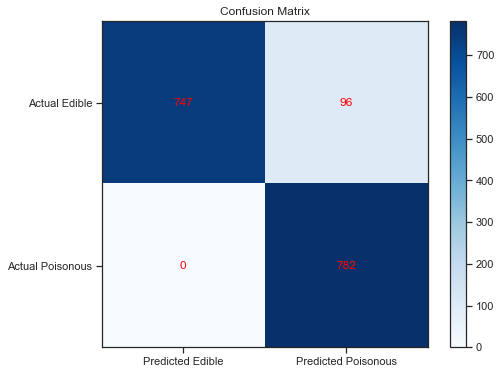
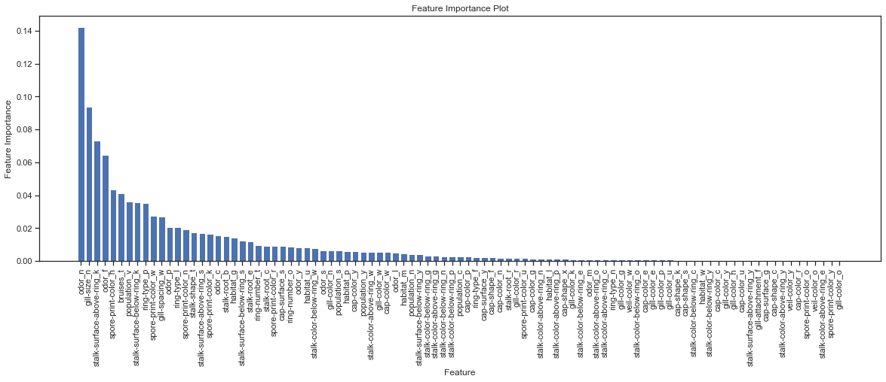

<h1>Mushroom Edibility Predictor(MEP)</h1>


<h2>Description</h2>
Mushroom Edibility Predictor" (MEP) relies on the Gaussian Naive Bayes algorithm and was trained using a dataset from the UCI Machine Learning repository.

Additionally, the "FeatureAnalyzer.py" tool is used to highlight the most influential features impacting the prediction process.
<br />


<h2>Languages and Utilities Used</h2>

- <b>Python</b> 
- <b>SpyderIDE</b>
- <b>Dataset from https://www.kaggle.com/datasets/uciml/mushroom-classification/data </b> 

<h2>Program walk-through:</h2>

<p align="center">
<br>
 
I trained the Gaussian Naive Bayes model using 80% of the dataset and conducted performance tests, which showed outstanding results.The accuracy score reached 0.94.
Also I created a Confusion Matric to visualize the result of the test

 <br/>

<br />
<br />
Then I analyzed the variables(features) that strongly affect the process of prediction.
The result is shown below.

Features such as  "Odor: None," "Gill Size: Narrow," and "Stalk Surface Above Ring: Silky" had high importance values.
The results indicate that a mushroom with those features is more likely to be edible.

However, their importance values  were relatively modest (ranging from 0.07 to 0.14), and some poisonous mushrooms may also share those features, so it is not recommended to rely on those features to identify the edibility of a mushroom.


  <br/>

<br />
<br />

</p>

<!--
 ```diff
- text in red
+ text in green
! text in orange
# text in gray
@@ text in purple (and bold)@@
```
--!>
